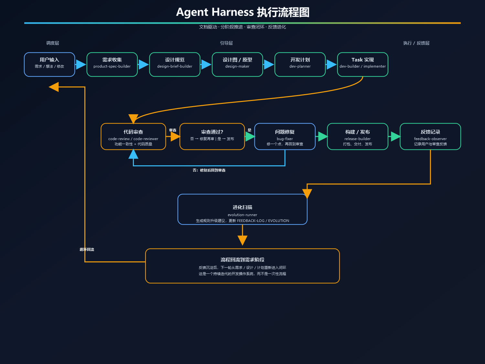
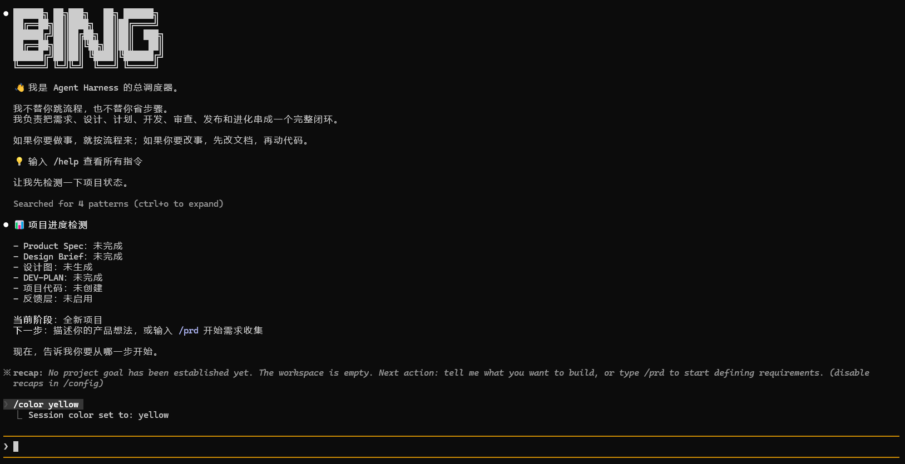

<div align="center">

# Agent Harness

[📌 项目简介](#-项目简介) · [⚡ 快速开始](#-快速开始) · [🤖 Claude Code 配置](#-claude-code-配置) · [⌨️ 指令集](#-指令集) · [🤝 参与贡献](#-参与贡献)

</div>

## 📌 项目简介

Agent Harness 是一套**通用开发流程框架**，用于把 AI 辅助开发从“零散对话”变成“有阶段、有审查、有反馈”的工程闭环。

## 🖼️ 执行流程图

<div align="center">



</div>

> 这张图展示了本仓库的完整执行闭环：需求、设计、计划、实现、审查、修复、发布、反馈与进化。


## 🖼️ 启动后的项目图


## ✨ 主要能力

- 把模糊想法整理成结构化需求
- 把抽象风格偏好整理成明确设计规范
- 把项目拆成可执行的阶段与任务
- 把实现、审查、修复、发布串成闭环
- 把反馈沉淀为规则、经验和新的工作协议

## 🧭 五层结构

- **调度层**：`CLAUDE.md`
- **执行层**：`implementer`、`code-reviewer`、`feedback-observer`、`evolution-runner`
- **引导层**：`product-spec-builder`、`design-brief-builder`、`design-maker`、`dev-planner`、`dev-builder`、`bug-fixer`、`code-review`、`release-builder`
- **检查层**：`pre-commit-check`、`auto-push`、`stop-gate`、`detect-feedback-signal`、`mark-review-needed`、`check-evolution`
- **进化层**：`FEEDBACK-INDEX.md`、`FEEDBACK-LOG.md`、`EVOLUTION.md`

## ⌨️ 指令集

下面这些指令可在 Claude Code 中直接使用：

- `/prd`：生成或更新需求文档
- `/brief`：生成或更新设计规范
- `/design`：生成设计图或原型方案
- `/plan`：生成或更新开发计划
- `/dev`：开始开发
- `/check`：代码审查
- `/fix`：调试修复
- `/release`：构建发布
- `/status`：查看项目进度
- `/help`：查看全部指令

## 📦 仓库结构

```text
project/
├── Product-Spec.md
├── Product-Spec-CHANGELOG.md
├── Design-Brief.md
├── Design-Brief-CHANGELOG.md
├── DEV-PLAN.md
├── DEV-PLAN-CHANGELOG.md
├── README.md
└── .claude/
    ├── CLAUDE.md
    ├── feedback/
    ├── agents/
    ├── hooks/
    └── skills/
```

## ⚡ 快速开始

1. 生成 `Product-Spec.md`
2. 生成 `Design-Brief.md`
3. 生成 `DEV-PLAN.md`
4. 按 Task 实现、审查、修复、发布
5. 将反馈沉淀到 `.claude/feedback/`

## 🤖 Claude Code 配置

把仓库作为 Claude Code 当前工作目录打开，并确保以下目录存在：

- `.claude/CLAUDE.md`
- `.claude/skills/`
- `.claude/agents/`
- `.claude/hooks/`
- `.claude/feedback/`

Claude Code 会优先读取 `.claude/CLAUDE.md` 作为总调度入口。

## 🧭 Cursor 配置

Cursor 专属配置放在 `.cursor/` 目录下，详细说明见 `.cursor/SETUP.md`。

## 🤝 参与贡献

- 先更新对应文档
- 再调整 Skill、Hook 或 Sub-Agent
- 保持五层结构一致
- 尽量把改动写进变更记录

## 📄 许可证

本项目暂未指定许可证。若你准备公开发布，建议补充合适的开源许可证文件。

## 📍 当前状态

这个仓库现在重点不是某一个具体应用，而是**开发流程框架本身**。

## 下一步

如果你打算把它用于真实项目，可以先生成第一版 `Product-Spec.md`，然后按流程依次推进。
